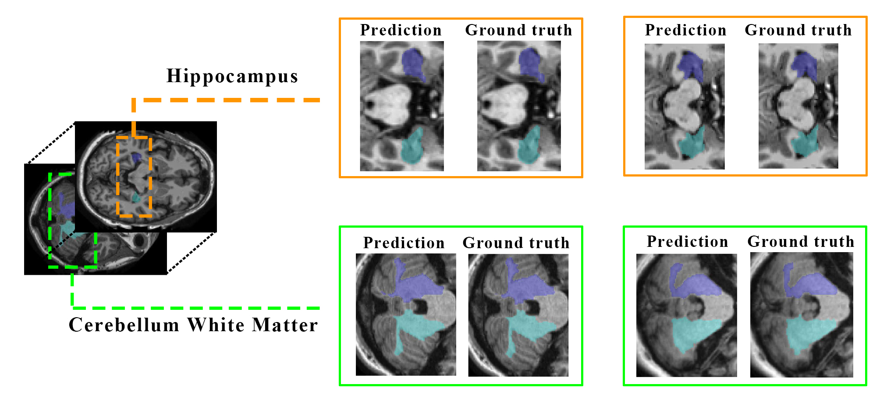

# A Fast and Light Brain MRI Segmentatin Framework for Clinical Applications

This code is an implementation of the our paper ([IEEEXplore](https://ieeexplore.ieee.org/document/9871715/)) in EMBC 2022. 
This is a framework for brain segmentation for clinical use. For this reason our approach works with the minimum GPU requirements and reasonable time.



___
## 1. Requirement
The code is written and tested on UBUNTU 18.06. For running the code you need:
1. MATLAB
2. nnU-Net dependency

For installing nnU-Net please follow the instruction on [nnU-Net](https://github.com/MIC-DKFZ/nnUNet) repository. Note that there is a step for configuration of the nnU-Net that should not be skiped.


## 2. Execution
The framework consists three main stages. For having the final results these parts should be executed in order. Before running the code, please customize the `config.m` file based on your own requirements.

### 2. Pre-process
In this part, the images dataset is registerd to MNI305 space and the intensities are normalized. For execution run `preprocess.m` file. The results will apear in `temp` file in code directory. 

### 3. Segmentation
In case of already having the trained weights for nnU-Net, you can go straight to prediction. For the list of structures in `config.m` please contact us to provide you with the trained networks (final weights). For contact detail look at the end of this page.

#### 3.1. Training
For training using the prepared data run the training command defined on [nnU-Net](https://github.com/MIC-DKFZ/nnUNet) for each structure.

#### 3.2. Predication
When pre-process stage in carried out, a command script will appaer in `tmp` folder. By executing the script in terminal or command line, the framework computes thepredictions.

```
bash predCommand.sh
```

### 2.3. Post-process
Post-process merges all the predictions into a single segmentation map. Run the `postprocess.m` file on MATLAB. The restuls will appear in `res` folder in code directory. This is the final result.

## 4. Citation
In case of using this code in your research or project please cite the paper below:

```
A. Nejad, S. Masoudnia and M. -R. Nazem-Zadeh, "A Fast and Memory-Efficient Brain MRI Segmentation Framework for Clinical Applications," 2022 44th Annual International Conference of the IEEE Engineering in Medicine & Biology Society (EMBC), 2022, pp. 2140-2143, doi: 10.1109/EMBC48229.2022.9871715.

```
[IEEEXplore](https://ieeexplore.ieee.org/document/9871715/keywords#keywords)

## 5. Remark and Acknowledgement
This code has been implemented at Research Center for Science and Technology in Medicine, Tehran University of Medical Sciences, Tehran, Iran.

This project was funded by Iran's National Elites Foundation (بنیاد ملی نخبگان).

## 6. Problem Shooting
In case of any problem in installation and running, feel free to create an issue. For a quicker response, send an email to [ashkan@nejad.info](mailto:ashkan@nejad.info). It is our honor to help the clinics and hospitals to have an easier experiment while working with out application. 

In case you need the application but you do not have MATLAB, send an email to the mentioned address and we will provide you with `.exe` files.
